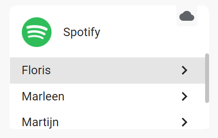

# Google Home Resume Package

## Table of contents

- [Google Home Resume Package](#google-home-resume-package)
  - [Table of contents](#table-of-contents)
  - [Background](#background)
- [🚨 USAGE OF THE AUTOMATION 🚨](#-usage-of-the-automation-)
  - [Latest version](#latest-version)
  - [Requirements](#requirements)
  - [Setup instructions](#setup-instructions)
    - [Updating from a previous version](#updating-from-a-previous-version)
      - [Prior to 2022.11](#prior-to-202211)
      - [From version 2022.11](#from-version-202211)
    - [Install the package](#install-the-package)
    - [Script Settings](#script-settings)
    - [Spotify resume](#spotify-resume)
      - [One Spotify Account](#one-spotify-account)
        - [Multiple accounts](#multiple-accounts)
          - [Example:](#example)
    - [YouTube Music resume](#youtube-music-resume)
    - [Dummy player for TTS with picture and text](#dummy-player-for-tts-with-picture-and-text)
  - [Description of scripts](#description-of-scripts)
    - [**Google Home Resume**](#google-home-resume)
    - [**Google Home Voice**](#google-home-voice)
    - [**Google Home Event**](#google-home-event)
  - [Known limitations](#known-limitations)
  - [Questions/issues/bugs/feature requests?](#questionsissuesbugsfeature-requests)
  - [Why not a blueprint?](#why-not-a-blueprint)
  - [☕ Coffee](#-coffee)

___

## Background

This package started somewhere in 2020 as a simple script to resume a Google Cast device after it was interrupted by a TTS message. During the years more functionality was added, the Cast devices can also be resumed after playing an audio file, or casting a Home Assistant Dasboard.
In the past years I also created others scripts using the Google Home Resume script. There is a script to determine on which device a question was asked and send a TTS or play a file on that specific device. Another script stores the state of the cast devices in a template sensor, so it can be resumed in later (for example store it when you leave home, and restore it when you arrive home again).

All these scripts are now combined in one package

___

#  🚨 USAGE OF THE AUTOMATION 🚨
The automation to start the resume is intended to be used as a backup. If you already know you are going to send (like a TTS or mp3) and know you want to resume what was playing afterwards, I strongly advice to start the script yourself, and not rely on the automation, as it is a bit flaky.
See [here](docs/google_home_resume.md#how-to-use-the-script) for instructions how to do that.

___

## Latest version

### 2023.8.0

### 📻 GENERAL

#### 🚨 BREAKING

* (2022.8.0) Removed support for Music Assistant. The integration is broken for a couple of months already, and the new version is still in beta. Will look at it again if the final version of MA2 is released

### :recycle: RESUME SCRIPT

#### ✨ New features

* Added support for resuming BBC streams (BBC Sounds and BBC Iplayer (for players with a screen))

#### 🐛 Bug fixes

* (2022.8.0) Fix bug in target determination
* (2022.8.0) Actually use the correct setting for enabling the automation, so now setting this to `false` actually works.

Previous changes can be found here:
* [General package changes](docs/changelogs/changelog_general.md)
* [Google Home Resume script and automation](docs/changelogs/changelog_google_home_resume.md)
* [Google Home Voice script](docs/changelogs/changelog_google_home_voice.md)
* [Google Home Event script and template sensor](docs/changelogs/changelog_google_home_event.md)

___

## Requirements

* Home Assistant version 2022.5 because the new script features introduced in that version are used.
* For Spotify resume Spotcast and the Spotify integration are requiresd. See the [relevant section](#spotify-resume) in the setup instructions.
* For YouTube Music Ytube Music Player is required. See the [relevant section](#youtube-music-resume) in the setup instructions.

___

## Setup instructions

### Updating from a previous version

#### Prior to 2022.11

If you are still using a version wich is not using the YYYY.MM version numbering, you are not using packages yet. Remove the existing Google Home scripts you are using (Resume/Voice/Event) and the Google Home Resume automation if you were using that. If you were using the Google Home Event script, also remove the template sensor used by that script.

After removing all the old stuff reload Scripts, Automations and Template entities from Developer Tools > YAML ([](https://my.home-assistant.io/redirect/server_controls/)) or restart Home Assistant. Then move on to [Install the package](#install-the-package).

#### From version 2022.11

Remove the Google Home Voice script if you were already using it, and the Google Home Event package if you were using that. Reload scripts and template entities in Developer Tools > YAML Developer Tools > YAML [](https://my.home-assistant.io/redirect/server_controls/) or restart Home Assistant.

🚨 **IMPORTANT: Add the settings for the Voice Script to the settings you already have.** The line `voice_settings: &voice_settings` needs to be included, otherwise you'll get errors while loading the configuration 🚨 Then copy everything below the settings from the package file on this GitHub repo and overwrite the current code in the package on your system using a file editor (like [Visual Studio Code Add-on](https://my.home-assistant.io/redirect/supervisor_addon/?addon=a0d7b954_vscode) or [File Editor Add-on](https://my.home-assistant.io/redirect/supervisor_addon/?addon=core_configurator)), not via the GUI.

Make sure to add these `voice_settings` in a way that the current settings are still under the `settings` key.

```yaml
## correct
settings: &settings
  primary_spotcast: john_doe
voice_settings: &voice_settings

## also correct
voice_settings: &voice_settings
settings: &settings
  primary_spotcast: john_doe

## not correct
settings: &settings
voice_settings: &voice_settings
  primary_spotcast: john_doe
```

### Install the package

[Link to the package](google_home_resume.yaml)

* In case you don't use packages yet, add the following to your `configuration.yaml`
```yaml
homeassistant:
  # include this line
  packages: !include_dir_named packages
```
* Create a folder named `packages` in your configuration folder (the same folder as where `configuration.yaml` is located)
* Create a file named `google_home_resume.yaml` in that folder, and paste the contents of the link above in that file.
* Change the settings in the file to match your setup

You can perform the steps above using a file editor (like [Visual Studio Code Add-on](https://my.home-assistant.io/redirect/supervisor_addon/?addon=a0d7b954_vscode) or [File Editor Add-on](https://my.home-assistant.io/redirect/supervisor_addon/?addon=core_configurator)), not via the GUI.

### Script Settings

There are no required settings, but if you use Google Home speaker groups you should define those as described below. Resuming Spotify with multiple accounts won't work properly without `primary_spotcast`. `dummy_player` is required to send a TTS with picture and text.

|Variable|Default|Example|Description|
| --- | --- | --- | --- |
|primary_spotcast||`pepijn`|The Spotify account which is used as primary account for spotcast, should match the last part of the Spotify media player.|
|radio_data||[My settings ](google_home_resume.yaml#L16-L28)|A dictionary with the pictures and titles. The picture urls should be full urls, not HA internal urls). As key value the artist should be used (check `media_artist` in developer tools > states)|
|speaker_groups||[My settings](google_home_resume.yaml#L29-L49)|A combination of a dictionary and a list, with speaker groups of which all entities are included in another speaker group.|
|default_volume_level|`0.25`|`0.5`|The default volume level to use to set the entity to if the old volume can not be retreived (this should actually never be used, but it there as a failsafe)|
|dummy_player||`media_player.vlc_telnet`|The dummy media_player used for the TTS with picture and text feature
|default_resume_delay|20 seconds|`20`|The delay after which the resume will started when it was interrupted by sending an image. Follows the syntax of [delay](https://www.home-assistant.io/docs/scripts/#wait-for-time-to-pass-delay), so also `"00:00:20"` or `seconds: 20` can be used.
|max_runtime||"00:10:00"|The maximum duration the Resume script should run, if this time is reached the script will be stopped. This avoids entities being logged in the groups, which will stop them from being resumed on a new disruption. Follows the syntax of [delay](https://www.home-assistant.io/docs/scripts/#wait-for-time-to-pass-delay), so also `600` or `minutes: 10` can be used.
|automation_enabled|`true`|`true`|If the automation for automatic resume should be used or not
|dashboard_cast|`false`|`false`|If the automation should be used in case a HA Dasboard is cast to the device
|announce_volume_automation||`0.75`|The volume used for announcements in the automation, remove or leave empty to leave the volume as it is.

For the Google Home Voice script there are 2 specific settings, these are described in the [documentation]() of the Voice script.

### Spotify resume

* For Spotify you need to have the [Spotify integration ](https://www.home-assistant.io/integrations/spotify/) installed, and [Spotcast ](https://github.com/fondberg/spotcast/) (available on [HACS](https://github.com/hacs/integration))

#### One Spotify Account

* In case you only have one Spotify account set up in Home Assistant, there are no additional settings needed besides installing the integrations above.

##### Multiple accounts

* In case you use multiple accounts, you need to add the Spotify integration for all accounts, in the [documentaton](https://www.home-assistant.io/integrations/spotify/) it's described how te set up multiple accounts.
* The entity_id's for media_player entities from the Spotify integration will be formatted like `media_player.spotify_{{ account name }}`. 
* For each Spotify account you need to add the `sp_key` and `sp_dc` as described in the [spotcast documentation](https://github.com/fondberg/spotcast#multiple-accounts). It is very important that the account names you use here, match the account names from the entity_ids of the Spotify media_player entities.
* As there the first entry in the spotcast settings doesn't have an account name, there will be one Spotify media_player entity which doesn't have a matching spotcast account. The account name part from that entity_id is what I call the `primary_spotcast` account.
* To determine the Spotify account, the source in the Spotify media_players is used. This is compared to the friendly name of the Goolge Home media_player. Therefor the Google Home media players in HA need to have the exact same name as they have in the Google Home app (this is also already a requirement for Spotcast to work with entity_id's). 

###### Example:

3 Spotify integrations:



The media_players entities connected to these Spotify integration are named:
```
media_player.spotify_floris
media_player.spotify_marleen
media_player.spotify_martijn
```

Spotcast setup (the Spotify account for `Floris` is the primary account, and has no named account in the spotcast setup), so the `primary_account` in this example is `floris`:
```yaml
spotcast:
  sp_dc: !secret sp_dc
  sp_key: !secret sp_key
  country: NL
  accounts:
    marleen:
      sp_dc: !secret sp_dc_marleen
      sp_key: !secret sp_key_marleen
    floris:
      sp_dc: !secret sp_dc_martijn
      sp_key: !secret sp_key_martijn
```

### YouTube Music resume

* Resume can be performed in case the custom [YouTube Music player](https://github.com/KoljaWindeler/ytube_music_player) integration is used to play the media. And only when YouTube music was started using that custom integration (which is quite easy using the media panel [](https://my.home-assistant.io/redirect/media_browser/))

### Dummy player for TTS with picture and text

In case you want to send a TTS with a picture and some text, you need to set up a dummy media_player which accepts TTS messages.

The feature to send a TTS together with picture and text works as as follows. The TTS is sent to a dummy player, and the script will wait for this event, and will take the url the the mp3 used as TTS message. It will then send this mp3 together with the picture and text to the actual target.
As of Home Assistant 2022.4 there is a check if a target of a service call actually supports the service call. So the dummy player has to support TTS. As the media_player created by the [VLC Telnet integration](https://www.home-assistant.io/integrations/vlc_telnet/) supports TTS, I use this.

In case you use HA OS, or run a supervised install, you can add the [VLC Add-on](https://my.home-assistant.io/redirect/supervisor_addon/?addon=core_vlc) from the add-on store. After starting the add-on it will automatically be detected by Home Assistant, and you can add the VLC Telnet integration. This will create `media_player.vlc_telnet` which you can use as dummy player.

In case you don't have the supervisor or already use this add-on for other purposes, you can possibly use the media_player created by the [browser_mod](https://github.com/thomasloven/hass-browser_mod) custom component. Or you can buy an additionaly Nest Mini, set the volume to `0` and hide it somewhere 😉

___

## Description of scripts

### **Google Home Resume**

The Google Home Resume script is used to resume a Google Home device after it has been interrupted. For example when a TTS has been sent, or when a sound has been played. You can manually trigger the script, and include the action after which it should be resumed in the service call for the script, or you can use the automation. 
More information on how to use the Google Home Resume script can be found [here](docs/google_home_resume.md)

### **Google Home Voice**

The Google Home Voice script uses Google Home Routines and Ambient sounds to check on which device you issued a voice command, so it can send a TTS message or other action to that specific device.
More information on how to use the Google Home Voice script can be found [here](docs/google_home_voice.md)

### **Google Home Event**

The Google Home Event script can store the data of your devices in a template sensor, so you can restore the states on a later moment. So you can store the state when you leave the house, and restore the music when you come back in.
More information on how to use the Google Home Event script can be found [here](docs/google_home_event.md)

___

## Known limitations

* It is possible to create speaker groups on the fly from the Google Home app, e.g. if you are playing something from Spotify on your Kitchen speaker, you can add your Living Room speaker in the Google Home app, without them belonging to a speaker group. The script won't recognize these groups created on the fly. The cast integration won't recognize these devices as playing anymore, so they won't be resumed.
* When Spotify switches to a new song or starts playing, the Spotify Media Player will shortly not show as playing. When at that moment the script is started, the stream will not be resumed afterwards. To minimize this, Spotify entities are updated just before the information is stored.
* YouTube and YouTube music will only resume the video/song which was playing at the time of the interruption, and only on players with a screen if not started using the [ytube_music_player](https://github.com/KoljaWindeler/ytube_music_player) custom integration.

___

## Questions/issues/bugs/feature requests?

In case you have a question, you found a bug, or have a feature request, you can either ask here, or open an [issue](https://github.com/TheFes/HA-configuration/issues) on my GitHub repository. In case you create a GitHub issue, please label it with `google home scripts`

In case something isn't working or you found a bug, a trace of the script will be needed in most cases to determine the cause. The trace can be downloaded as a json file. To do this follow the steps below:

1. Go to `Configuration > Automations & Scenes > Scripts` or use [](https://my.home-assistant.io/redirect/scripts/)
1. Find the Google Home scripts in the list.
1. Click on 3 dot menu icon left of the script and then select `Traces`
1. Make sure to select the right trace which contains the error
1. Press the 3 dot menu icon in the top right corner, and select `Download trace`
1. Press the download icon in the top right corner.
1. Repeat for the Google Home Resume - Helper Script if the error is in that step.

In case you create the issue on GitHub you can upload the json files, in case you create the issue as a post here, you can copy the json files to a code sharing website like [dpaste.org](https://www.dpaste.org). Please create a different link for each json file.

___

## Why not a blueprint?

I've been asked a couple of times if I ever considered to make a blueprint out of this script. I do understand this would make updates more easy, however there are also some things which make it quite complicated:
* You need to provide information on your speaker groups, players with a screen and spotcast account. That would mean that you will have to do that each time you use the blueprint to create a script, or that you'll have to add this information each time the blueprint is updated, which would reduce the easiness of updating the script.
* I tried to bypass the point above by using includes, but the blueprint would do that once, and add the informaton in the yaml, instead of keeping the include code.
* I use really large and complicated templates, and these would be converted to really messy one line templates, making it impossible to read and debug if needed.

So, basically, I gave it a try, and decided it would not work :)

___

## ☕ Coffee

If you like this script, please feel free to buy me a coffee (I might spend it on another beverage though).
In case you decide to do so, thanks a lot!

<a href="https://www.buymeacoffee.com/thefes" target="_blank"></a>
